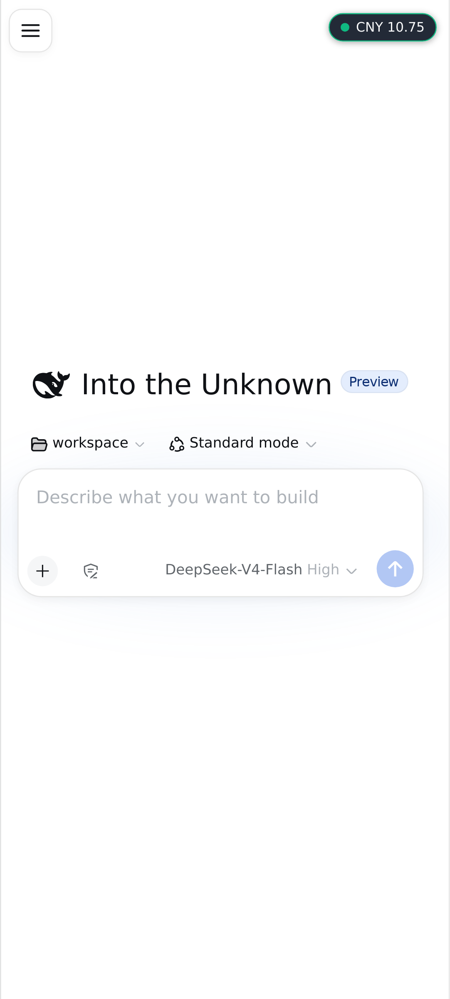
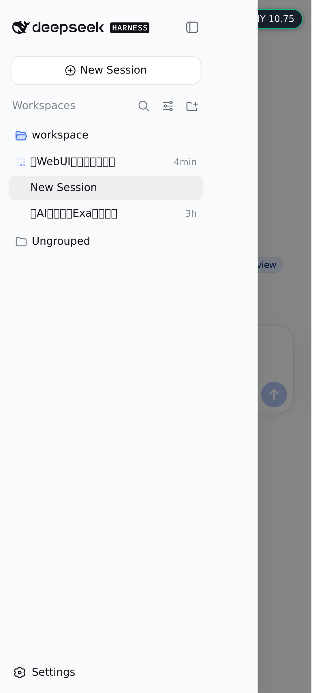
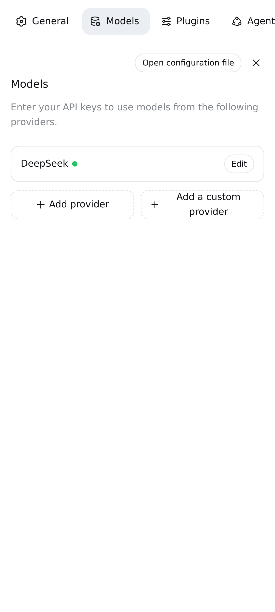
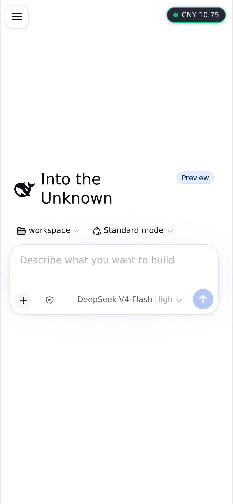

# dsh-client-ui-android

Android / mobile adaptation for the [DeepSeek Harness](https://github.com/deepseek-ai/deepseek-harness) web GUI (`dsh web`).

When the GUI is opened from an Android phone (or any narrow touch screen), this plugin detects it and makes the desktop UI usable on a phone:

- off-canvas sidebar drawer with a floating hamburger button,
- full-screen settings with a horizontal nav row,
- a single-line composer toolbar (+ / permission / model / send) that never overlaps,
- safe-area insets, no double-tap zoom, tap-target polish.

English | [中文](README.zh.md)

## Screenshots

| Phone home (drawer) | Drawer open | Settings (Models) | Composer toolbar |
| --- | --- | --- | --- |
|  |  |  |  |

## What it does

### 1. Android detection

At page load the browser half reads the user agent + UA-Client-Hints and stamps `<html>`:

- `data-platform="android"`, `data-android="true"` (+ `data-android-version`),
- `data-device-type="mobile|tablet|desktop"`, `data-touch`,
- `data-dsh-mobile` / `data-dsh-tablet` + the `dsh-mobile` / `dsh-android` classes,
- a debug snapshot at `window.__DSH_DEVICE__`.

### 2. Touch-first base (mobile & tablet)

- viewport upgraded to `viewport-fit=cover` + `interactive-widget=resizes-content`
  (the composer stays above the Android keyboard, content avoids the cutout/gesture area),
- safe-area insets on the app frame (`env(safe-area-inset-*)`),
- `touch-action: manipulation` (no double-tap zoom / 300ms tap delay), 16px input
  font (no focus zoom), overscroll containment (no accidental pull-to-refresh).

### 3. Phone layout (`data-dsh-mobile`)

- the AppFrame collapses to a single column,
- the sidebar becomes an **off-canvas drawer** (hamburger button opens it, a scrim
  closes it), the details column becomes a slide-in drawer, drag handles are hidden,
- drawers slide with `left`/`right` offsets — **never `transform`** — so
  `position: fixed` overlays (the settings modal is rendered inside the sidebar)
  are not trapped in a transformed containing block.

### 4. Settings modal on phones

Full-screen page with a horizontal nav row (the desktop two-column layout would
otherwise squeeze the content column); long model names get ellipsis truncation and
permission rows keep their text + selector pill from overflowing.

### 5. Composer toolbar row

On phones the "+" button, the permission button, the model name and the send button
stay on **one line**: the permission trigger is compacted to an icon-only button (its
name appears in the picker after tapping), and the model group may only shrink (name
ellipsis) on very narrow screens — nothing ever overlaps.

### 6. Inert on desktop

Nothing changes when the platform is not Android / not a narrow touch device.

## Install

Requires DeepSeek Harness `>= 0.1.0-rc.6` (the web surface with client bundles).

### Option A — from npm

```sh
dsh plugin --profile web add dsh-client-ui-android
```

### Option B — from GitHub

```sh
dsh plugin --profile web add github:<your-username>/dsh-client-ui-android
```

### Option C — manual (no pnpm)

1. Put the `dsh-client-ui-android` folder into `~/.dsh/profiles/web/node_modules/`.
2. Add it to `dsh.profile.bundles` in `~/.dsh/profiles/web/package.json`:

```json
"dsh": {
  "profile": {
    "bundles": [
      "@deepseek-ai/dsh-base",
      "@deepseek-ai/dsh-web-app",
      "dsh-client-ui-android"
    ]
  }
}
```

Then restart `dsh web` and **refresh the page** (hard refresh on the phone). Open the
GUI from an Android phone and the adaptation kicks in automatically. On desktop
nothing changes.

## How it works

- **Host half** (`lib/index.js`) — a minimal cordis loader entry. It exists so the
  profile loader can mount the package and the client-modules scanner can serve the
  browser bundle; it does nothing itself.
- **Browser half** (`lib/client.js`) — declared via `dsh.client` in `package.json`
  (platform `web`, eager load). It is served at `/plugins/dsh-client-ui-android/client.js`
  and appears in `window.__DSH_BOOT__`. It runs the detection pass, injects a scoped
  stylesheet, tags the AppFrame / settings modal with stable `data-*` attributes, and
  mounts the hamburger + scrim into the `shell.overlay` slot.
- **Patch** (`cordis.patch.yml`) — the profile patch row that activates the bundle.

The `lib/*.js` files are the source — plain JS, no build step required.

## Compatibility

- Android Chrome / WebView (modern), and any narrow touch browser (iOS included for
  the touch base layer).
- The scoped CSS uses `:has()` (Chrome 105+/Safari 15.4+), `100dvh`, and
  `interactive-widget=resizes-content` (Chrome 108+) with graceful fallbacks.

## Development

```sh
# edit lib/client.js, then copy the folder into the profile and restart
# or use the HMR flow: pnpm run dev:web from the deepseek-harness checkout
```

## License

MIT
